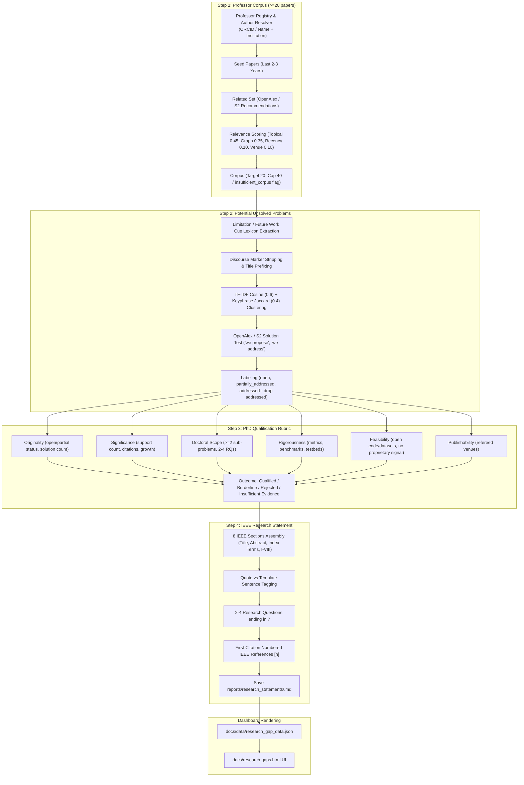

# Architecture Investigation & Specification: Research Problem Generator (`alertme`)

---

## 1. Summary

The Research Problem Generator (`src/research_gaps/`) is a hybrid PhD topic discovery and research statement formulation engine. It discovers PhD research topics via rule-based literature analysis, assesses PhD thesis qualification against the Dublin Descriptors (EQF Level 8), assembles comprehensive evidence bundles of up to 40 works with verified links, formulates IEEE-structured research statements using Gemini REST API (`gemini-2.5-flash`), and renders results on the GitHub Pages dashboard (`docs/research-gaps.html`).

**Key Architectural Features:**
1. **Gemini LLM for Formulation Only:** Gemini REST API (`gemini-2.5-flash` per `config/research_gaps.yaml`) is used strictly for problem formulation and statement writing. The LLM NEVER writes DOIs, URLs, or reference entries. Structured JSON output schema, low temperature (0.2), 1 retry with error feedback, max 15 calls per run limit, sha256 input hash caching, HTTP 429 backoff/queueing, and code-side validation (≥20 distinct references per statement, section minimums, questions ending in `?`). Falls back to rule-based template generation tagged `generation_method="template"` when no key is present or retry fails.
2. **Phase 2 Link Verification & Fallback Chain:** Verified DOI URLs built using official DOI REST API (`GET https://doi.org/api/handles/<doi>`) with redirect detection (HTTP 403/429/999 treated as blocked, not dead). 5-level fallback chain: Verified DOI -> OpenAlex OA / landing page -> arXiv -> Semantic Scholar -> OpenAlex work page. Dead links render as plain text `"link unavailable"`, and internal IDs like `doi_<hash>` never leak into user-facing output.
3. **Phase 3 Evidence Bundle:** `EvidenceBundleBuilder` ([src/research_gaps/evidence_bundle.py](file:///Users/obaromoses/Desktop/AlertMe/src/research_gaps/evidence_bundle.py)) builds bundles of up to 40 works per problem with complete metadata and verified links, deduplicated by DOI/OpenAlex ID/normalized title, with stable reference keys (`R1`, `R2`...) and roles (`gap_evidence`, `method`, `evaluation`, `background`, `related_work`), persisted to `data/evidence_bundles.json`.
4. **Four-Step Hybrid Pipeline (`ResearchGapPipeline.run()`):**
   - **Step 1 (Corpus):** Builds target corpus of ≥20 papers per professor using OpenAlex and Semantic Scholar APIs.
   - **Step 2 (Unsolved Problems):** Cue claim extraction, TF-IDF + Jaccard clustering, OpenAlex/S2 solution testing.
   - **Step 3 (PhD Qualification):** 6-dimension Dublin Descriptors (Level 8) & EQF 8 rubric.
   - **Step 4 (Statement Formulation):** Gemini REST API formulation (or template fallback) with deterministically rendered reference lists and IEEE markdown export.
5. **Rotating Batch Execution & State Persistence:** Rotating batch execution with persistent corpora under `data/`.
6. **Zero Silent Failures:** Log fetch/LLM failures, count them in run report, and fail workflow before deploying if key is present but all LLM calls fail, or if no professor produces a valid corpus.

---

## 2. Repo and Runtime Map

| Component | Technology / Path | Details |
|---|---|---|
| **Language & Runtime** | Python 3.9+ / 3.11 | CPython; tested on macOS (3.9.6) and CI Ubuntu (`3.11` via GitHub Actions) |
| **Frameworks & Core Libs** | Standard Library (`re`, `math`, `hashlib`, `json`), `requests`, `pyyaml` | Direct REST API calls via `requests` |
| **CLI Entry Point** | `src/cli.py` | Command: `python -m src.cli research-gaps [--mode 4step|legacy] [--professor "Name"] [--batch-size N]` |
| **Pipeline Orchestrator** | `src/research_gaps/pipeline.py` | Class `ResearchGapPipeline.run(mode="4step", professor_name=..., batch_size=10)` |
| **Corpus Builder (Step 1)** | `src/research_gaps/corpus_builder.py` | `ProfessorRegistry`, `OpenAlexAuthorResolver`, `CorpusBuilder` |
| **Unsolved Extractor (Step 2)** | `src/research_gaps/unsolved_extractor.py` | Cue lexicon extraction, TF-IDF + Jaccard clustering, OpenAlex/S2 solution testing |
| **PhD Assessor (Step 3)** | `src/research_gaps/phd_assessor.py` | `PhDQualificationAssessor` evaluating Dublin Descriptors / EQF 8 across 6 dimensions |
| **Link Verifier (Phase 2)** | `src/research_gaps/link_verifier.py` | `LinkVerifier` with official DOI Handle REST API checks and 5-level fallback chain |
| **Evidence Bundle (Phase 3)** | `src/research_gaps/evidence_bundle.py` | `EvidenceBundleBuilder` assembling up to 40 works per problem with stable keys and roles |
| **LLM Formulation (Phase 4)** | `src/research_gaps/llm_formulation.py` | `GeminiFormulator` using Gemini REST API (`gemini-2.5-flash`) for statement formulation |
| **Statement Generator (Fallback)**| `src/research_gaps/statement_generator.py` | `IEEEResearchStatementGenerator` producing template statements on fallback |
| **Dashboard & Reports** | `src/research_gaps/dashboard_generator.py` | Saves `docs/data/research_gap_data.json` and renders `docs/research-gaps.html` |
| **Scheduler / CI Trigger** | `.github/workflows/research-gap-analysis.yml` | Weekly cron schedule, manual workflow dispatch, and `GEMINI_API_KEY` secret wiring |

---

## 3. Four-Step Algorithm Architecture

---

## 4. Key Defaults, Thresholds, and Configuration

- **AI Model Status:** 0% AI models (`extraction_method="rules"`).
- **Batching:** Default rotating batch size: 10 professors (least recently processed first; refetch interval 14 days).
- **Corpus Requirements:** Target 20 papers per professor, cap 40. Below 20 flags `insufficient_corpus=True`.
- **Clustering Threshold:** Combined similarity threshold `0.45` (0.6 TF-IDF cosine + 0.4 Keyphrase Jaccard).
- **Solution Thresholds:**
  - `0` matching solution works -> `open`
  - `1-3` matching solution works -> `partially_addressed`
  - `> 3` matching solution works -> `addressed` (cluster dropped from discovery)
- **PhD Qualification Rule:** Criteria 1 (`original`) and 3 (`doctoral_scope`) pass AND at least 4 of 6 criteria overall pass/partial -> `qualified`.
- **IEEE Research Statement Constraints:** Maximum 1,200 words, abstract 150-250 words, 2-4 research questions ending in `?`.
