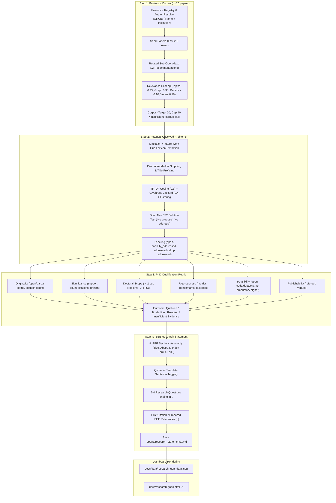

# Architecture Investigation & Specification: Research Problem Generator (`alertme`)

---

## 1. Summary

The Research Problem Generator (`src/research_gaps/`) is a 100% rule-based, zero-AI model engine for discovering PhD research topics, assessing PhD thesis qualification against the Dublin Descriptors (EQF Level 8), generating IEEE-structured research statements, and rendering results on the GitHub Pages dashboard (`docs/research-gaps.html`).

**Key Architectural Features:**
1. **Zero LLM usage:** 100% rule-based and plain-Python statistics (TF-IDF/BM25 cosine similarity, keyphrase Jaccard, lexicon matching). All AI models, Anthropic API calls, and LLM dependencies have been removed. Outputs are tagged with `extraction_method="rules"`.
2. **Four-Step Deterministic Pipeline (`ResearchGapPipeline.run()`):**
   - **Step 1 (Corpus):** Builds a target corpus of at least 20 highly relevant papers per professor (cap 40) using OpenAlex and Semantic Scholar APIs with strict author matching and relevance scoring.
   - **Step 2 (Unsolved Problems):** Extracts limitation/future-work cue claims, clusters them via combined TF-IDF cosine + keyphrase Jaccard, and tests for solution coverage using OpenAlex/S2 solution cues.
   - **Step 3 (PhD Qualification):** Evaluates candidate problem clusters against a 6-dimension rubric based on Dublin Descriptors (Level 8) and EQF Level 8.
   - **Step 4 (IEEE Statement):** Assembles an 8-section IEEE research statement with verbatim quoted claims `[n]`, template sentences, 2-4 research questions ending in `?`, and first-citation numbered IEEE references.
3. **Rotating Batch Execution & State Persistence:** Processes professors in rotating batches (default 10, configurable via CLI `--batch-size` or `--professor "Name"`). Persists corpora and results under `data/` so state survives CI runs.
4. **Zero Silent Failures:** Log fetch failures, count them in run report, and fail workflow before deploying if no professor produces a valid corpus.
5. **Backwards Compatibility:** Legacy flow preserved behind `--mode legacy`; 4-step discovery is the default for `python -m src.cli research-gaps`.

---

## 2. Repo and Runtime Map

| Component | Technology / Path | Details |
|---|---|---|
| **Language & Runtime** | Python 3.9+ / 3.11 | CPython; tested on macOS (3.9.6) and CI Ubuntu (`3.11` via GitHub Actions) |
| **Frameworks & Core Libs** | Standard Library (`re`, `math`, `hashlib`, `json`), `requests`, `pyyaml` | No heavy ML/LLM libraries |
| **CLI Entry Point** | `src/cli.py:786-790` | Command: `python -m src.cli research-gaps [--mode 4step|legacy] [--professor "Name"] [--batch-size N]` |
| **Pipeline Orchestrator** | `src/research_gaps/pipeline.py:33-250` | Class `ResearchGapPipeline.run(mode="4step", professor_name=..., batch_size=10)` |
| **Corpus Builder (Step 1)** | `src/research_gaps/corpus_builder.py` | `ProfessorRegistry`, `OpenAlexAuthorResolver`, `CorpusBuilder` |
| **Unsolved Extractor (Step 2)** | `src/research_gaps/unsolved_extractor.py` | Cue lexicon extraction, TF-IDF + Jaccard clustering, OpenAlex/S2 solution testing |
| **PhD Assessor (Step 3)** | `src/research_gaps/phd_assessor.py` | `PhDQualificationAssessor` evaluating Dublin Descriptors / EQF 8 across 6 dimensions |
| **Statement Generator (Step 4)** | `src/research_gaps/statement_generator.py` | `IEEEResearchStatementGenerator` producing IEEE 8-section statements and `.md` files |
| **Dashboard & Reports** | `src/research_gaps/dashboard_generator.py` | Saves `docs/data/research_gap_data.json` and renders `docs/research-gaps.html` |
| **Scheduler / CI Trigger** | `.github/workflows/research-gap-analysis.yml` | Weekly cron schedule and manual workflow dispatch |

---

## 3. Four-Step Algorithm Architecture

---

## 4. Key Defaults, Thresholds, and Configuration

- **AI Model Status:** 0% AI models (`extraction_method="rules"`).
- **Batching:** Default rotating batch size: 10 professors (least recently processed first; refetch interval 14 days).
- **Corpus Requirements:** Target 20 papers per professor, cap 40. Below 20 flags `insufficient_corpus=True`.
- **Clustering Threshold:** Combined similarity threshold `0.45` (0.6 TF-IDF cosine + 0.4 Keyphrase Jaccard).
- **Solution Thresholds:**
  - `0` matching solution works -> `open`
  - `1-3` matching solution works -> `partially_addressed`
  - `> 3` matching solution works -> `addressed` (cluster dropped from discovery)
- **PhD Qualification Rule:** Criteria 1 (`original`) and 3 (`doctoral_scope`) pass AND at least 4 of 6 criteria overall pass/partial -> `qualified`.
- **IEEE Research Statement Constraints:** Maximum 1,200 words, abstract 150-250 words, 2-4 research questions ending in `?`.
