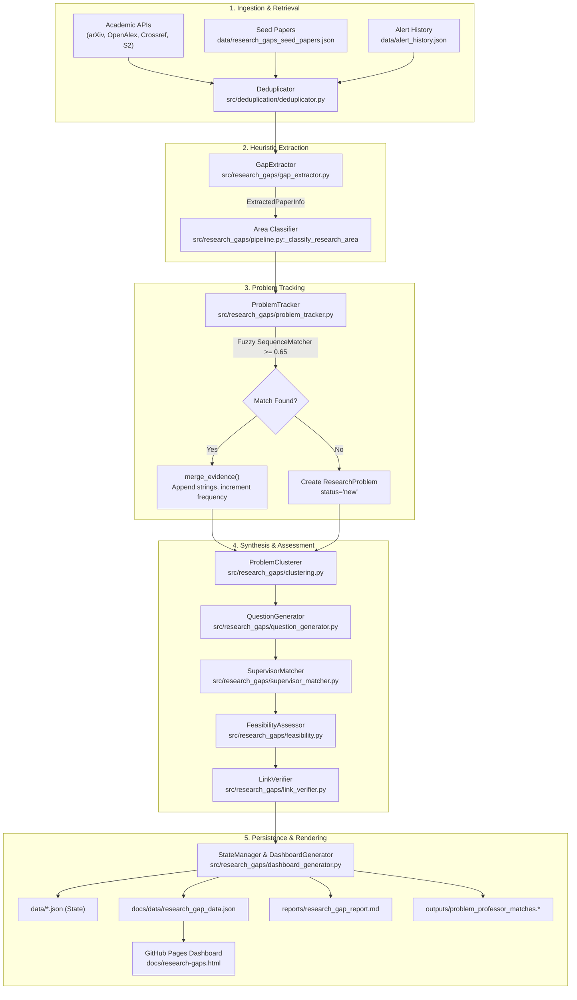

# Architecture Investigation: Research Problem Generator (`alertme`)

---

## 1. Summary

The research problem generator (`src/research_gaps/`) is an offline/batch discovery engine that extracts research problems, limitations, and future work from paper abstracts, clusters them, assesses PhD feasibility, matches supervisors, and renders static dashboard cards in `docs/research-gaps.html`.

**Top 5 Findings:**
1. **Zero LLM usage:** The entire generator is 100% deterministic rule-based NLP using regular expressions and string splitting (`src/research_gaps/gap_extractor.py:10-144`); no LLM, embeddings, or semantic parsing are used.
2. **Regex collision causes field duplication:** The first sentence of an abstract matches both `problem_patterns` and `method_patterns`, causing `candidate_methods` to duplicate `problem_statement` verbatim (`src/research_gaps/gap_extractor.py:81-96`, `src/research_gaps/problem_tracker.py:103`).
3. **No claim-to-source provenance:** Sentences for limitations and unresolved questions are appended as unlinked plain strings; paper references are SHA-256 hashes of DOIs (`doi_<16hex>`) without citation bindings (`src/models.py:127-129`, `src/research_gaps/problem_tracker.py:59-70`).
4. **Card UI relies on hardcoded fallbacks:** `Existing Approaches` is not extracted or stored, falling back to JavaScript literal `'Baseline algorithms'`; `Publication Potential` rationale is computed but omitted from HTML rendering (`docs/research-gaps.html:824, 832`).
5. **Inverted and corpus-agnostic novelty scoring:** "Novelty" is rated "high" solely because `frequency <= 3` in the local batch (`src/research_gaps/feasibility.py:54-60`), with no external literature query or corpus validation.

---

## 2. Repo and Runtime Map

| Component | Technology / Path | Details |
|---|---|---|
| **Language & Runtime** | Python 3.9+ / 3.11 | CPython; tested on macOS (3.9.6) and CI Ubuntu (`3.11` via GitHub Actions) |
| **Frameworks & Core Libs** | Standard Library (`re`, `difflib`, `hashlib`), `requests`, `pyyaml` | No heavy NLP frameworks (spaCy, NLTK, Transformers not installed) |
| **CLI Entry Point** | `src/cli.py:776-785` | Command: `python -m src.cli research-gaps [--skip-link-verification]` |
| **Pipeline Class** | `src/research_gaps/pipeline.py:33-305` | Class `ResearchGapPipeline.run(verify_links=True)` |
| **Scheduler / CI Trigger** | `.github/workflows/research-gap-analysis.yml:1-67` | Cron `0 9 * * 0` (Sundays 09:00 UTC) and manual `workflow_dispatch` |
| **Configuration** | `config/research_gaps.yaml:1-78` | Search queries, target areas, thresholds, collection limits |
| **State & Persistence** | `data/*.json` | `research_problems.json`, `extracted_papers.json`, `feasibility_assessments.json`, `research_gaps_seed_papers.json` |
| **Dashboard Output** | `docs/data/*.json`, `docs/research-gaps.html` | Deployed to GitHub Pages via Actions artifact upload (`actions/deploy-pages@v4`) |
| **Reports Output** | `reports/research_gap_report.md`, `outputs/problem_professor_matches.*` | Generated Markdown, JSON, and CSV digests |

---

## 3. Pipeline: Flowchart and Stage Table

### 3.1 Mermaid Architecture Flowchart



### 3.2 Stage Execution Table

| Stage | File : Function / Symbol | Input & Output Types | Method / Implementation | External Services / Deps |
|---|---|---|---|---|
| **1. Collect** | `src/research_gaps/pipeline.py:97-138` (`_init_collectors`) | Config queries → `List[ResearchItem]` | API requests + file loads (`seed_papers.json`, `alert_history.json`) | arXiv, OpenAlex, Crossref, Semantic Scholar APIs |
| **2. Deduplicate** | `src/deduplication/deduplicator.py:20-65` (`deduplicate`) | `List[ResearchItem]` → `List[ResearchItem]` | Exact DOI matching + `difflib.SequenceMatcher` title similarity (≥0.85) | None (in-memory) |
| **3. Extract** | `src/research_gaps/gap_extractor.py:75-144` (`extract_batch`) | `ResearchItem` → `ExtractedPaperInfo` | Sentence tokenization (`re.split`) + deterministic regex pattern matching on abstract | None (deterministic NLP) |
| **4. Track & Merge** | `src/research_gaps/problem_tracker.py:77-110` (`add_or_update_problem`) | `ExtractedPaperInfo` → `ResearchProblem` | `difflib.SequenceMatcher` (threshold 0.65) against existing `problem_statement` | `data/research_problems.json` |
| **5. Cluster** | `src/research_gaps/clustering.py:125-165` (`cluster_problems`) | `List[ResearchProblem]` → `List[ResearchGapCluster]` | Keyword Jaccard (0.4) + string similarity (0.6) graph clustering (threshold 0.55) | None |
| **6. Direction Gen** | `src/research_gaps/question_generator.py:11-59` (`generate_directions`) | `ResearchProblem` → `CandidateResearchDirection` | String templating (`f"What algorithmic... overcome {limitation}"`) | None |
| **7. Supervisor Match** | `src/research_gaps/supervisor_matcher.py:348-468` (`match_all`) | `ResearchProblem` → `Dict[str, List[SupervisorMatch]]` | Multi-factor: keyword Jaccard (0.45) + bio text (0.3) + pub overlap (0.2) + recruitment (0.05) | `src/supervisors/data/*/professors.json` |
| **8. Feasibility** | `src/research_gaps/feasibility.py:16-53` (`assess_batch`) | `ResearchProblem` → `FeasibilityAssessment` | Rule-based heuristics evaluating list counts and frequency | None |
| **9. Link Verify** | `src/research_gaps/link_verifier.py:175-215` (`verify_all_links`) | Paper & match URLs → `Dict[str, LinkVerificationResult]` | HTTP HEAD/GET requests with redirect chasing and soft-404 detection | External HTTP hosts |
| **10. Dashboard Export** | `src/research_gaps/dashboard_generator.py:27-124` (`generate_dashboard_data`) | All models → Dict payload & static JSON/MD files | JSON assembly, atomic filesystem writes | `docs/data/`, `reports/`, `outputs/` |
| **11. Render Card** | `docs/research-gaps.html:777-839` (`filterProblems`) | `data/research_gap_data.json` → HTML Table & Expandable Cards | Vanilla JavaScript DOM manipulation | Web Browser / GitHub Pages |

---

## 4. Data Model: Card Schema and Reference/ID Handling

### 4.1 Reference Card Field Mapping

| UI Field / Card Row | Model & Field | Type | How Produced | Required? | Source Text / Input |
|---|---|---|---|---|---|
| **Problem Statement** | `ResearchProblem.problem_statement` (`src/research_gaps/models.py:99`) | `str` | Extracted verbatim: first sentence matching `problem_patterns` | Yes | First matching sentence of `item.abstract` (`gap_extractor.py:81, 95`) |
| **Known Limitations** | `ResearchProblem.known_limitations` (`src/research_gaps/models.py:106`) | `List[str]` | Extracted verbatim: sentences matching `limitation_patterns` | No (defaults to `[]`) | Sentences from `item.abstract` (`gap_extractor.py:84, 102`) |
| **Unresolved Questions** | `ResearchProblem.unresolved_questions` (`src/research_gaps/models.py:107`) | `List[str]` | Extracted verbatim: sentences matching `future_work_patterns` | No (defaults to `[]`) | Sentences from `item.abstract` (`gap_extractor.py:85, 103`) |
| **Supporting Literature** | `ResearchProblem.supporting_papers` (`src/research_gaps/models.py:102`) | `List[str]` | Hashed paper ID string list | Yes | `item.id` (`models.py:127-129`), rendered via `paperMap` in HTML |
| **Existing Approaches** | `ResearchProblem.existing_approaches` (`src/research_gaps/models.py:105`) | `List[str]` | **Not populated by pipeline.** Rendered via UI hardcoded fallback `'Baseline algorithms'` | No (defaults to `[]`) | None. Hardcoded in `docs/research-gaps.html:824` |
| **Candidate Methods** | `ResearchProblem.candidate_methods` (`src/research_gaps/models.py:109`) | `List[str]` | Copied from `paper_info.proposed_approach` (which collided with `problem_statement`) | No (defaults to `[]`) | Sentence 1 of `item.abstract` (`gap_extractor.py:96`, `problem_tracker.py:103`) |
| **Evaluation Metrics** | `ResearchProblem.evaluation_metrics` (`src/research_gaps/models.py:110`) | `List[str]` | Substring matching from 16 metric keywords | No (defaults to `[]`) | `item.abstract` substring search (`gap_extractor.py:59-66`) |
| **Novelty** | `FeasibilityAssessment.novelty` (`src/research_gaps/models.py:211`) | `str` | Threshold on `problem.frequency <= 3` -> `"high"` | Yes | `src/research_gaps/feasibility.py:54-60` |
| **Novelty Evidence** | `FeasibilityAssessment.novelty_evidence` (`src/research_gaps/models.py:212`) | `str` | Formatted string `f"Based on {len(supporting_papers)} paper(s)..."` | Yes | `src/research_gaps/feasibility.py:57` |
| **Feasibility** | `FeasibilityAssessment.feasibility` (`src/research_gaps/models.py:215`) | `str` | Threshold on `len(candidate_methods) > 0` -> `"medium"` | Yes | `src/research_gaps/feasibility.py:71-78` |
| **Feasibility Evidence** | `FeasibilityAssessment.feasibility_evidence` (`src/research_gaps/models.py:216`) | `str` | Hardcoded literal `"Partial methodology established in literature."` | Yes | `src/research_gaps/feasibility.py:77` |
| **Publication Potential** | `FeasibilityAssessment.publication_potential` (`src/research_gaps/models.py:223`) | `str` | Threshold on `frequency >= 1 and len(limitations) >= 1` -> `"high"` | Yes | `src/research_gaps/feasibility.py:104-107` |
| **Publication Evidence** | `FeasibilityAssessment.publication_evidence` (`src/research_gaps/models.py:224`) | `str` | Hardcoded literal; **omitted from HTML display** | Yes | Computed in `feasibility.py:106`, ignored in `research-gaps.html:832` |
| **PhD Depth** | `FeasibilityAssessment.phd_depth` (`src/research_gaps/models.py:225`) | `str` | Threshold on `len(unresolved_questions) == 1` -> `"medium"` | Yes | `src/research_gaps/feasibility.py:109-115` |
| **PhD Depth Evidence** | `FeasibilityAssessment.phd_depth_evidence` (`src/research_gaps/models.py:226`) | `str` | Hardcoded literal `"Sufficient for focused PhD scope or initial papers."` | Yes | `src/research_gaps/feasibility.py:114` |
| **Status** | `ResearchProblem.status` (`src/research_gaps/models.py:114`) | `str` | Initialized as `'new'`; promoted to `'investigating'` by fallback loop | Yes | `src/research_gaps/pipeline.py:201-205` |

### 4.2 Reference ID and Provenance Architecture

```
ResearchItem.doi: "10.1109/TPDS.2023.3289012"
      │
      ▼ (src/models.py:127-129: clean_doi.lower() -> sha256 -> truncated 16 hex chars)
ResearchItem.id = "doi_fd8071479658a576"
      │
      ▼ (src/research_gaps/gap_extractor.py:112: ExtractedPaperInfo(paper_id=item.id))
ExtractedPaperInfo.paper_id = "doi_fd8071479658a576"
      │
      ▼ (src/research_gaps/problem_tracker.py:100: ResearchProblem(supporting_papers=[paper_info.paper_id]))
ResearchProblem.supporting_papers = ["doi_fd8071479658a576"]
      │
      ▼ (docs/research-gaps.html:814-818: const paper = paperMap[pid] || { title: pid, url: '' })
UI Link: 📄 doi_fd8071479658a576  (when paperMap lookup unmapped or rendered from standalone problem list)
```

- **ID collision in models:** `src/models.py:129` generates `f"doi_{hash}"`, while `src/research_gaps/models.py:64` generates `f"paper_{hash}"`. Because `gap_extractor.py:112` sets `paper_id=item.id`, the `doi_` prefix dominates [Confirmed].
- **Claim provenance:** In `ResearchProblem` (`src/research_gaps/models.py:96-137`), `known_limitations`, `unresolved_questions`, and `evidence` are flat `List[str]`. The identity of which paper contributed which claim is **completely dropped** during `merge_evidence` (`src/research_gaps/problem_tracker.py:55-75`) [Confirmed].

---

## 5. Prompts and LLM Usage

### 5.1 Research Gap Generator (`src/research_gaps/`)
- **LLM Calls:** **0 (None).**
- **Prompts:** **None.**
- Static analysis of all files in `src/research_gaps/*.py` confirms zero imports of `openai`, `google.generativeai`, `anthropic`, or LLM clients, and zero prompt templates [Confirmed].

### 5.2 AlertMe Daily Pipeline Comparison (`src/summarization/intelligence.py`)
For architectural context, the parent system AlertMe contains a single LLM integration in `src/summarization/intelligence.py:113-156` (used only for daily email summaries, *not* for the research gap cards):
- **File & Line:** `src/summarization/intelligence.py:115-132`
- **Model:** `gemini-1.5-flash` (via direct HTTP endpoint: `https://generativelanguage.googleapis.com/v1beta/models/gemini-1.5-flash:generateContent`)
- **Parameters:** `generationConfig: {"response_mime_type": "application/json"}`, `timeout=20`
- **API Key:** Variable `GEMINI_API_KEY` or `LLM_API_KEY` (`src/summarization/intelligence.py:19-20`)
- **Verbatim Prompt:**
```text
You are an expert academic research assistant preparing for a PhD in Edge Computing & Distributed Systems.
Analyze this academic publication metadata and return a strict JSON object.

Title: {item.title}
Venue: {item.venue}
Abstract: {item.abstract}

JSON Schema:
{
  "why_it_matters": "1-2 sentences on why this paper is critical for Edge Computing / Edge AI research.",
  "research_problem": "Precise research problem or bottleneck being addressed.",
  "methodology": "The technical approach, algorithm, or system architecture used.",
  "key_contribution": "The main theoretical or empirical contribution and performance result.",
  "potential_gap": "Potential research direction — requires validation through deeper literature review: [Identify realistic limitation or unexplored extension in heterogeneous real-world edge settings].",
  "relevance_to_phd": "{item.score.final_score if item.score else 8.5}/10"
}

Respond ONLY with valid JSON.
```
- **Output Parsing & Validation:** Parsed with standard `json.loads(text)` (`line 144`). No Pydantic schema validation; fields read via `.get()`. If parsing fails or API returns non-200, it silently falls back to `_analyze_deterministic()` (`lines 31, 35-111`).
- **Prompt Versioning:** Hardcoded string, unversioned, no temperature parameter set.

---

## 6. Scoring Logic and Retrieval Layer

### 6.1 Feasibility & Novelty Rubrics (`src/research_gaps/feasibility.py`)

All evaluations operate strictly on list lengths and integer counts of the single `ResearchProblem` instance:

```python
# Novelty (lines 54-60)
freq = problem.frequency
if freq <= 3:   return "high",   f"Based on {len(problem.supporting_papers)} paper(s) found directly addressing this problem."
elif freq <= 6: return "medium", f"Moderate coverage in literature with {len(problem.supporting_papers)} supporting papers."
else:           return "low",    f"Well-studied problem with {len(problem.supporting_papers)} papers."

# Significance (lines 62-69)
if len(problem.known_limitations) >= 2 or len(problem.evidence) >= 2:
    return "high", f"Validated by {len(problem.known_limitations)} known limitations across publications."
elif len(problem.known_limitations) == 1:
    return "medium", "Addressed by at least one major limitation identified in recent work."
else:
    return "low", "Limited evidence of critical system bottleneck."

# Feasibility (lines 71-78)
has_methods = len(problem.candidate_methods) > 0
has_approaches = len(problem.existing_approaches) > 0
if has_methods and has_approaches:
    return "high", f"Candidate methods exist ({', '.join(problem.candidate_methods[:2])}) building on existing foundations."
elif has_methods or has_approaches:
    return "medium", "Partial methodology established in literature."
else:
    return "low", "Requires developing foundational methodology from scratch."

# Publication Potential (lines 104-107)
if problem.frequency >= 1 and len(problem.known_limitations) >= 1:
    return "high", "High interest in top-tier conferences (SEC, INFOCOM, MobiCom, NeurIPS)."
else:
    return "medium", "Suitable for domain-specific workshops and transactions."

# PhD Depth (lines 109-115)
q_count = len(problem.unresolved_questions)
if q_count >= 2:   return "high",   f"{q_count} unresolved questions provide sufficient scope for a multi-year thesis."
elif q_count == 1: return "medium", "Sufficient for focused PhD scope or initial papers."
else:              return "low",    "May require broader problem formulation for a complete thesis."
```

### 6.2 Retrieval & Ingestion Layer (`src/research_gaps/pipeline.py:59-138`)

- **Sources Queried:**
  - arXiv (`src/collectors/arxiv.py`): 3 queries, `max_results=40`
  - OpenAlex (`src/collectors/openalex.py`): 2 queries, `max_results=40`
  - Crossref (`src/collectors/crossref.py`): 2 queries, `rows=40`
  - Semantic Scholar (`src/collectors/semantic_scholar.py`): 2 queries, `limit=40`
  - Local Seed Literature (`data/research_gaps_seed_papers.json`): 10 hand-curated papers
  - Historical Alerts (`data/alert_history.json`): prior pipeline outputs
- **Ranking:** Collectors sort by publication date descending (`publication_date:desc`). No relevance ranking is performed during gap collection.
- **Deduplication:** `Deduplicator.deduplicate()` (`src/deduplication/deduplicator.py:20-65`) removes identical DOIs or normalized title similarity ≥0.85.
- **Problem Grouping / Deduplication Threshold:**
  `ProblemTracker.find_existing_problem` (`src/research_gaps/problem_tracker.py:44-53`) uses `difflib.SequenceMatcher` with a strict ratio of **0.65** on the raw problem statement string. Because abstract opening sentences are diverse, disparate papers almost never reach 0.65 string similarity. Hence, **1 document feeds 1 problem card** [Confirmed].

---

## 7. Symptom Verdicts

| # | Symptom | Verdict | Root Cause (File : Line) | Confidence |
|---|---|---|---|---|
| **1** | Problem statement is a topic-level claim, not a scoped gap, and doesn't match limitations | **Confirmed** | `src/research_gaps/gap_extractor.py:15-18, 81, 95`. Sentence 1 of the abstract (`"Deploying deep learning models on resource-constrained edge devices faces acute memory and latency bottlenecks"`) contains the keyword `"bottlenecks"`, matching `problem_patterns`. It is taken greedily as the problem statement. Sentence 2 (the actual specific bottleneck) is skipped. No scoping, synthesis, or validation exists. | Confirmed |
| **2** | Reference is opaque hash ID (`doi_<hash>`), no citation metadata, no claim-to-source mapping | **Confirmed** | `src/models.py:127-129` generates `doi_<16hex>` via SHA-256 on the DOI string. `src/research_gaps/models.py:102` stores only `List[str]` in `supporting_papers`. When `paperMap[pid]` does not resolve in `docs/research-gaps.html:815`, it falls back to printing `pid` (`doi_fd8071479658a576`). In `problem_tracker.py:59-70`, limitations and unresolved questions are appended as unlinked plain strings without paper IDs or text spans. | Confirmed |
| **3** | Candidate Methods duplicates Problem Statement; Existing Approaches is placeholder | **Confirmed** | `src/research_gaps/gap_extractor.py:19-22, 96` + `src/research_gaps/problem_tracker.py:103`. Sentence 1 contains `"deep learning"` and `"models"`, which matches `method_patterns`. Thus `proposed_approach` equals `research_problem`. `problem_tracker.py:103` sets `candidate_methods=[paper_info.proposed_approach]`. For Existing Approaches, `gap_extractor.py` has no extraction logic, leaving `existing_approaches=[]`. `docs/research-gaps.html:824` renders `'Baseline algorithms'` as a hardcoded JavaScript fallback string. | Confirmed |
| **4** | Limitations and unresolved questions are verbatim sentences lifted from papers | **Confirmed** | `src/research_gaps/gap_extractor.py:27-32, 50-57, 102-103`. Sentences matching regexes `limitation_patterns` and `future_work_patterns` are copied directly from the abstract into Python lists without rewriting or LLM transformation. | Confirmed |
| **5** | Ratings derived from paper count of 1 with no rubric; Publication Potential lacks rationale | **Confirmed** | `src/research_gaps/feasibility.py:54-115`. Hardcoded `if/else` checks on list lengths (`frequency <= 3` -> novelty="high", `len(candidate_methods) > 0` -> feasibility="medium", `frequency >= 1 and len(limitations) >= 1` -> pub_potential="high"). In `docs/research-gaps.html:832`, the template renders `feas.publication_potential` but omits `feas.publication_evidence`, hiding the rationale. | Confirmed |
| **6** | Headings say "existing literature" but content comes from one source | **Confirmed** | `src/research_gaps/problem_tracker.py:44-53, 93-108`. `find_existing_problem` requires `difflib.SequenceMatcher >= 0.65` on raw sentence text. Two independent papers never share 65% verbatim character identity in their opening sentences, so each paper generates an independent problem card with `supporting_papers` count = 1. | Confirmed |

---

## 8. Unknowns and Information Needed

1. **Production Corpus Scale (Unknown):** How many papers are collected in a standard production run when external APIs are unblocked? (In local test/offline mode, only the 10 seed papers in `data/research_gaps_seed_papers.json` are processed).
2. **LLM Provider Preference for Redesign (Need from user):** Does the redesign plan to utilize local SLMs/LLMs (e.g., via Ollama/vLLM), Claude/OpenAI APIs, or Gemini API (which is already configured via `GEMINI_API_KEY` in `src/summarization/intelligence.py`)?
3. **Full-Text vs. Abstract Access (Need from user):** Is full-text PDF parsing (e.g., via `PyMuPDF` or `grobid`) in scope for the redesign, or will ingestion remain restricted to publisher abstracts? (Most limitations and future work appear in Sections 6/7 of full papers, whereas abstracts often omit explicit limitations).
4. **Historical Alerts Ingestion (Inferred):** Line 121 of `src/research_gaps/pipeline.py` loads `data/alert_history.json`. It is unknown whether production runs frequently accumulate enough overlapping items to test cross-paper synthesis.

---

## 9. Intervention Points (Ranked by Impact & Effort)

Ranked from highest ROI to lowest:

| Rank | Intervention Point | Location in Codebase | Proposed Change (Design Only) | Impact | Effort |
|---|---|---|---|---|---|
| **1** | **Structured LLM Extraction & Scoping** | `src/research_gaps/gap_extractor.py:75-132` | Replace regex matching with a single structured LLM call (JSON mode / Pydantic schema) that outputs: (a) Scoped Research Gap Question, (b) Root Cause / Why Unresolved, (c) Specific Existing Baseline Methods, (d) Proposed Candidate Directions. | **Critical** (Eliminates Symptoms 1, 3, 4) | Medium |
| **2** | **Claim-Level Citation & Provenance Tracking** | `src/research_gaps/models.py:33-138`, `problem_tracker.py:55-75` | Refactor `known_limitations` and `unresolved_questions` from `List[str]` to `List[EvidenceClaim]`, where each claim contains: `{ claim_text: str, paper_id: str, citation_str: str, doi: str, url: str }`. | **High** (Eliminates Symptom 2) | Low |
| **3** | **Semantic Embedding Deduplication** | `src/research_gaps/problem_tracker.py:44-54` | Replace character `difflib.SequenceMatcher >= 0.65` with cosine similarity on dense embeddings (e.g. `sentence-transformers` or text-embedding API, threshold ~0.82) to cluster problems by conceptual overlap rather than exact phrasing. | **High** (Eliminates Symptom 6) | Low-Medium |
| **4** | **Rubric-Based PhD Feasibility Engine** | `src/research_gaps/feasibility.py:54-115` | Replace list-length heuristics with a multi-criteria rubric: (a) External literature saturation via OpenAlex citation/work count, (b) Benchmark & dataset availability check, (c) Compute requirements vs. academic lab resources. Fix HTML display of `publication_evidence`. | **Medium** (Eliminates Symptom 5) | Medium |
| **5** | **Dashboard Schema Harmonization** | `docs/research-gaps.html:814-835`, `dashboard_generator.py:27-108` | Embed full citation objects (`{ title, authors, year, venue, url, doi }`) directly within the problem card dictionary in `docs/data/research_gap_data.json` instead of requiring fragile client-side `paperMap` ID resolution. | **Medium** (Fixes UI presentation bugs) | Low |
| **6** | **Full-Text Section Parsing** | `src/collectors/*.py`, `gap_extractor.py:42-48` | Ingest Introduction, Discussion, and Conclusion sections (when arXiv/open-access HTML is available) rather than restricting extraction to abstracts. | **High** | High |
