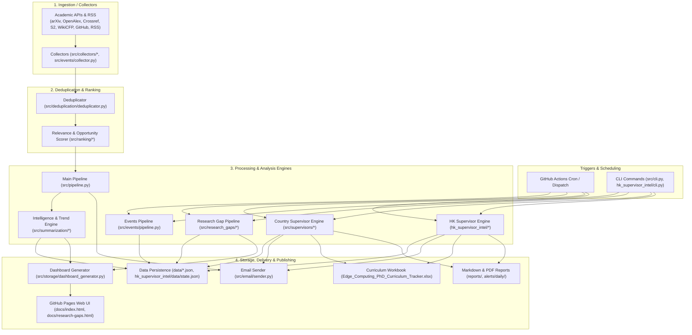

# AlertMe System Overview & Architecture Report

## 1. System Overview

`AlertMe` is an autonomous research intelligence assistant for PhD preparation in Edge Computing, Edge AI, and Distributed Systems. It ingests academic publications, preprints, RSS feeds, conference CFPs, PhD vacancies, and events, then deduplicates, ranks (0–10 scale), and structurally analyzes them. Outputs are delivered via HTML/text emails, stored in JSON state files, compiled into Markdown/PDF dossiers, and published to a static GitHub Pages dashboard (`docs/`). Runs are triggered by scheduled GitHub Actions crons or CLI invocations.

## 2. Architecture & Data Flow

## 3. Module Summary Table

| Module | Path | Purpose | Inputs → Outputs | External Services |
| :--- | :--- | :--- | :--- | :--- |
| **Core Orchestrator** | [src/cli.py](file:///Users/obaromoses/Desktop/AlertMe/src/cli.py), [src/pipeline.py](file:///Users/obaromoses/Desktop/AlertMe/src/pipeline.py) | Coordinates daily/weekly discovery, filtering, intelligence, and email dispatch | Config YAMLs, CLI args → JSON state, Email alerts, Dashboard data | Resend, Brevo, SendGrid, SMTP |
| **Academic Ingestion** | [src/collectors/](file:///Users/obaromoses/Desktop/AlertMe/src/collectors/) | Ingests papers, CFPs, PhD openings, scholarships, and GitHub repos | Config queries, RSS feeds → `List[ResearchItem]` | arXiv, OpenAlex, Crossref, Semantic Scholar, GitHub, RSS |
| **Deduplication & Ranking** | [src/deduplication/](file:///Users/obaromoses/Desktop/AlertMe/src/deduplication/), [src/ranking/](file:///Users/obaromoses/Desktop/AlertMe/src/ranking/) | Multi-stage deduplication (DOIs/titles) and transparent 0–10 relevance scoring | `List[ResearchItem]` → Ranked `List[ResearchItem]` | None (in-memory) |
| **Intelligence & Trends** | [src/summarization/](file:///Users/obaromoses/Desktop/AlertMe/src/summarization/) | Extracts paper insights, 30-day n-gram trends, and supervisor watchlist | `ResearchItem` → `PaperIntelligence`, `trends.json`, `supervisors.json` | Google Gemini API (optional) |
| **Events Engine** | [src/events/](file:///Users/obaromoses/Desktop/AlertMe/src/events/) | Discovers, normalizes, verifies, and scores Edge & ML/IoT conferences | `config/events.yaml`, RSS → `data/events.json`, `data/ml_iot_events.json` | WikiCFP (HTTP RSS) |
| **Research Gaps Engine** | [src/research_gaps/](file:///Users/obaromoses/Desktop/AlertMe/src/research_gaps/) | 4-step algorithm (Corpus, Unsolved Problems, PhD Qualification Rubric, IEEE Statements) | Curated professors, OpenAlex/S2 APIs → `docs/data/research_gap_data.json`, `reports/research_statements/` | OpenAlex API, Semantic Scholar API (no AI models) |
| **Country Supervisor Intel** | [src/supervisors/](file:///Users/obaromoses/Desktop/AlertMe/src/supervisors/) | Profiles & ranks PhD supervisors across 7 countries (CA, DE, HK, JP, SE, UK, US) | `src/supervisors/data/*/*.json` → `data/supervisor_state.json`, Dossiers, Excel | None (Curated JSON) |
| **HK Supervisor Intel** | [hk_supervisor_intel/](file:///Users/obaromoses/Desktop/AlertMe/hk_supervisor_intel/) | Standalone Hong Kong supervisor intelligence & 3-day daily briefing engine | `hk_supervisor_intel/data/*.json` → `hk_supervisor_intel/data/state.json`, Briefs | None (Curated JSON) |
| **Data Storage & Dashboard** | [src/storage/](file:///Users/obaromoses/Desktop/AlertMe/src/storage/), [docs/](file:///Users/obaromoses/Desktop/AlertMe/docs/) | Atomic JSON persistence and static GitHub Pages web dashboard rendering | Pipeline outputs → `data/*.json`, `docs/data.json`, `docs/index.html` | GitHub Pages |
| **Multi-Channel Email** | [src/email/](file:///Users/obaromoses/Desktop/AlertMe/src/email/), [templates/](file:///Users/obaromoses/Desktop/AlertMe/templates/) | Renders Jinja2 HTML/text templates and dispatches via configured provider | `ResearchItem` lists → Inbox HTML/text emails, `data/output/latest_email.*` | Resend, Brevo, SendGrid, SMTP |

## 4. Detailed Module Notes

### Core Orchestrator & CLI
- **How it works**: `ResearchPipeline.run()` ([src/pipeline.py:129](file:///Users/obaromoses/Desktop/AlertMe/src/pipeline.py#L129)) invokes collectors, runs `Deduplicator`, ranks via `RelevanceScorer`, generates intelligence/trends, and dispatches email via `EmailSender`.
- **Models/APIs**: Delegates to `IntelligenceEngine` and `EmailSender`.
- **Config & Env**: `config/*.yaml` loaded via `ConfigManager` ([src/utils/config_loader.py:50](file:///Users/obaromoses/Desktop/AlertMe/src/utils/config_loader.py#L50)), `EMAIL_RECIPIENT`, `EMAIL_PROVIDER`.
- **Failure & Fallbacks**: Collector exceptions caught ([src/collectors/base.py:53](file:///Users/obaromoses/Desktop/AlertMe/src/collectors/base.py#L53)); pipeline continues with remaining items.
- **Tests**: [tests/test_cli.py](file:///Users/obaromoses/Desktop/AlertMe/tests/test_cli.py), [tests/test_existing_system_regression.py](file:///Users/obaromoses/Desktop/AlertMe/tests/test_existing_system_regression.py).
- **Evident Problems**: Event filtering in `run()` ([src/pipeline.py:185](file:///Users/obaromoses/Desktop/AlertMe/src/pipeline.py#L185)) checks `item_type == ItemType.EVENT.value`, but `ConferenceCollector` converts CFPs to `CONFERENCE_CFP`, bypassing this check (inferred).

### Academic Ingestion
- **How it works**: `BaseCollector` ([src/collectors/base.py:15](file:///Users/obaromoses/Desktop/AlertMe/src/collectors/base.py#L15)) uses `PoliteRequester` for rate limiting. Ingests from arXiv ([arxiv.py](file:///Users/obaromoses/Desktop/AlertMe/src/collectors/arxiv.py)), OpenAlex ([openalex.py](file:///Users/obaromoses/Desktop/AlertMe/src/collectors/openalex.py)), Crossref ([crossref.py](file:///Users/obaromoses/Desktop/AlertMe/src/collectors/crossref.py)), Semantic Scholar ([semantic_scholar.py](file:///Users/obaromoses/Desktop/AlertMe/src/collectors/semantic_scholar.py)), GitHub ([github_repos.py](file:///Users/obaromoses/Desktop/AlertMe/src/collectors/github_repos.py)), RSS ([rss_collector.py](file:///Users/obaromoses/Desktop/AlertMe/src/collectors/rss_collector.py)), and lab pages ([lab_recruitment.py](file:///Users/obaromoses/Desktop/AlertMe/src/collectors/lab_recruitment.py)).
- **Models/APIs**: REST/XML APIs for arXiv, OpenAlex, Crossref, Semantic Scholar, GitHub.
- **Config & Env**: `config/sources.yaml`, `config/phd_opportunities.yaml`, `SEMANTIC_SCHOLAR_API_KEY`, `GITHUB_TOKEN`.
- **Failure & Fallbacks**: 3 failures set collector status to `Failing` ([src/collectors/base.py:59](file:///Users/obaromoses/Desktop/AlertMe/src/collectors/base.py#L59)); `LabRecruitmentCollector` falls back to curated offline positions ([src/collectors/lab_recruitment.py:107](file:///Users/obaromoses/Desktop/AlertMe/src/collectors/lab_recruitment.py#L107)).
- **Tests**: [tests/test_collectors.py](file:///Users/obaromoses/Desktop/AlertMe/tests/test_collectors.py), [tests/test_opportunities.py](file:///Users/obaromoses/Desktop/AlertMe/tests/test_opportunities.py), [tests/test_recruitment.py](file:///Users/obaromoses/Desktop/AlertMe/tests/test_recruitment.py).
- **Evident Problems**: `ArxivCollector` uses HTTP URL (`http://export.arxiv.org/api/query`, [src/collectors/arxiv.py:10](file:///Users/obaromoses/Desktop/AlertMe/src/collectors/arxiv.py#L10)).

### Deduplication & Ranking
- **How it works**: `Deduplicator` ([src/deduplication/deduplicator.py:20](file:///Users/obaromoses/Desktop/AlertMe/src/deduplication/deduplicator.py#L20)) matches exact DOIs, arXiv IDs, URLs, and title similarity (≥0.85). `RelevanceScorer` ([src/ranking/scorer.py:25](file:///Users/obaromoses/Desktop/AlertMe/src/ranking/scorer.py#L25)) ranks items 0–10 (Topic Match 0–4.0, Credibility 0–2.5, Recency 0–1.5, Stage 0–1.0, PhD 0–1.0, Penalty 0 to -5.0; min score ≥6.5).
- **Models/APIs**: None (in-memory string distance & heuristic scoring).
- **Config & Env**: `config/topics.yaml`, `config/profile.yaml`.
- **Failure & Fallbacks**: Returns score 5.0 on missing metadata.
- **Tests**: [tests/test_deduplication.py](file:///Users/obaromoses/Desktop/AlertMe/tests/test_deduplication.py), [tests/test_scoring.py](file:///Users/obaromoses/Desktop/AlertMe/tests/test_scoring.py).
- **Evident Problems**: None identified.

### Intelligence & Trends
- **How it works**: `IntelligenceEngine.analyze()` ([src/summarization/intelligence.py:23](file:///Users/obaromoses/Desktop/AlertMe/src/summarization/intelligence.py#L23)) extracts structured research insights (problem, methodology, contributions, gap). Uses deterministic regex rules by default; calls Gemini API when enabled. `TrendDetector` ([src/summarization/trends.py:18](file:///Users/obaromoses/Desktop/AlertMe/src/summarization/trends.py#L18)) tracks 30-day n-gram velocity (`↑↑`, `↑`, `→`, `↓`).
- **Models/APIs**: Google Gemini Flash (`gemini-1.5-flash`, [src/summarization/intelligence.py:135](file:///Users/obaromoses/Desktop/AlertMe/src/summarization/intelligence.py#L135)).
- **Config & Env**: `config/profile.yaml` (`ai_summarization`), `GEMINI_API_KEY` / `LLM_API_KEY`.
- **Failure & Fallbacks**: Automatically falls back to deterministic NLP on AI call error ([src/summarization/intelligence.py:31](file:///Users/obaromoses/Desktop/AlertMe/src/summarization/intelligence.py#L31)).
- **Tests**: [tests/test_intelligence.py](file:///Users/obaromoses/Desktop/AlertMe/tests/test_intelligence.py).
- **Evident Problems**: Gemini model name in `profile.yaml` defaults to legacy `gemini-1.5-flash`.

### Events Module
- **How it works**: `ConfigurableEventCollector` ([src/events/collector.py:24](file:///Users/obaromoses/Desktop/AlertMe/src/events/collector.py#L24)) loads curated events from `config/events.yaml` / `config/ml_iot_events.yaml`, and fetches WikiCFP RSS. `EventVerifier` ([src/events/verifier.py:16](file:///Users/obaromoses/Desktop/AlertMe/src/events/verifier.py#L16)) performs offline status checks. `EventRelevanceScorer` ([src/events/scorer.py:18](file:///Users/obaromoses/Desktop/AlertMe/src/events/scorer.py#L18)) ranks events 0–10.
- **Models/APIs**: WikiCFP RSS (`http://www.wikicfp.com/cfp/rss?...`).
- **Config & Env**: `config/events.yaml`, `config/ml_iot_events.yaml`.
- **Failure & Fallbacks**: RSS feed errors logged; falls back to curated YAML events.
- **Tests**: [tests/test_events_module.py](file:///Users/obaromoses/Desktop/AlertMe/tests/test_events_module.py), [tests/test_ml_iot_events_module.py](file:///Users/obaromoses/Desktop/AlertMe/tests/test_ml_iot_events_module.py).
- **Evident Problems**: `data/events*.json` state files are gitignored (.gitignore:29-34), preventing state persistence across CI runs (inferred). Main pipeline `EventsStateManager().save_events()` ([src/pipeline.py:257](file:///Users/obaromoses/Desktop/AlertMe/src/pipeline.py#L257)) overwrites `data/events.json` with combined events, corrupting edge-only filtering.

### Research Gaps Engine
- **How it works & Architecture Summary**: Documented in [ARCHITECTURE_research_problem_generator.md](file:///Users/obaromoses/Desktop/AlertMe/ARCHITECTURE_research_problem_generator.md). `ResearchGapPipeline.run()` ([src/research_gaps/pipeline.py:46](file:///Users/obaromoses/Desktop/AlertMe/src/research_gaps/pipeline.py#L46)) executes a 4-step deterministic pipeline: (1) `CorpusBuilder` builds target corpus of ≥20 papers per professor; (2) `UnsolvedProblemExtractor` extracts cue claims, clusters gaps via TF-IDF + Jaccard, and tests for solutions via OpenAlex/S2; (3) `PhDQualificationAssessor` evaluates Dublin Descriptors (Level 8) & EQF 8 rubric across 6 criteria; (4) `IEEEResearchStatementGenerator` produces 8-section IEEE research statements saved to `reports/research_statements/<problem_id>.md` and published to `docs/data/research_gap_data.json` for rendering in `docs/research-gaps.html`.
- **Models/APIs**: 100% rule-based and plain-Python statistics (`extraction_method="rules"`). Zero LLM usage. Academic APIs used: OpenAlex API and Semantic Scholar API (optional `SEMANTIC_SCHOLAR_API_KEY` and `GITHUB_TOKEN`).
- **Config & Env**: `config/research_gaps.yaml`, `SEMANTIC_SCHOLAR_API_KEY`, `GITHUB_TOKEN`.
- **Failure & Fallbacks**: Log fetch failures, count them in run report, and fail workflow before deploying if no professor produces a valid corpus. Legacy flow available via `--mode legacy`.
- **Tests**: [tests/test_research_gaps.py](file:///Users/obaromoses/Desktop/AlertMe/tests/test_research_gaps.py) (68 unit tests covering all 4 steps, offline end-to-end, IEEE formatting, citation order, and zero-LLM verification).
- **Drift vs Architecture Doc**: Architecture doc updated; current code matches the 4-step zero-LLM specification.

### Country Supervisor Intelligence
- **How it works**: `CountryCampaignManager` ([src/supervisors/campaign.py:21](file:///Users/obaromoses/Desktop/AlertMe/src/supervisors/campaign.py#L21)) orchestrates campaigns across 7 countries (CA, DE, HK, JP, SE, UK, US). `SupervisorAnalyzer` ([src/supervisors/analyzer.py:22](file:///Users/obaromoses/Desktop/AlertMe/src/supervisors/analyzer.py#L22)) scores professors. `DossierProfiler` ([src/supervisors/profiler.py:25](file:///Users/obaromoses/Desktop/AlertMe/src/supervisors/profiler.py#L25)) compiles MD, PDF, DOCX, EPUB dossiers in `reports/supervisors/`. Updates `Edge_Computing_PhD_Curriculum_Tracker.xlsx` master workbook via `excel_extension.py`.
- **Models/APIs**: None (Curated dataset JSONs in `src/supervisors/data/`).
- **Config & Env**: `src/supervisors/data/<country>/{professors,universities,funding}.json`, `EMAIL_RECIPIENT`, `EMAIL_PROVIDER`.
- **Failure & Fallbacks**: Loads fallback professor profiles if country state is uninitialized.
- **Tests**: [tests/test_country_supervisors.py](file:///Users/obaromoses/Desktop/AlertMe/tests/test_country_supervisors.py), [tests/test_generic_dossier_engine.py](file:///Users/obaromoses/Desktop/AlertMe/tests/test_generic_dossier_engine.py).
- **Evident Problems**: Codebase duplication with `hk_supervisor_intel/` package.

### HK Supervisor Intelligence (Standalone)
- **How it works**: Standalone module for 8 target Hong Kong universities. `DiscoveryEngine` ([hk_supervisor_intel/discovery.py:16](file:///Users/obaromoses/Desktop/AlertMe/hk_supervisor_intel/discovery.py#L16)) filters candidates; `ScoringEngine` ([hk_supervisor_intel/scoring.py:16](file:///Users/obaromoses/Desktop/AlertMe/hk_supervisor_intel/scoring.py#L16)) ranks professors; `AlertGenerator` ([hk_supervisor_intel/alerts.py:19](file:///Users/obaromoses/Desktop/AlertMe/hk_supervisor_intel/alerts.py#L19)) drives a 3-day progressive daily briefing cycle (Day 1: Overview, Day 2: Papers, Day 3: Pitch) saved to `alerts/daily/`.
- **Models/APIs**: None (Curated dataset JSONs in `hk_supervisor_intel/data/`).
- **Config & Env**: `hk_supervisor_intel/config.py`, `EMAIL_RECIPIENT`, `EMAIL_PROVIDER`.
- **Failure & Fallbacks**: Uses local state persistence (`hk_supervisor_intel/data/state.json`).
- **Tests**: [tests/test_hk_scoring.py](file:///Users/obaromoses/Desktop/AlertMe/tests/test_hk_scoring.py), [tests/test_campaign_and_alerts.py](file:///Users/obaromoses/Desktop/AlertMe/tests/test_campaign_and_alerts.py).
- **Evident Problems**: Duplicate scoring, storage, dossier generation, and Excel tracking alongside `src/supervisors/`. Workflow [.github/workflows/hk_supervisor_daily_intel.yml:71](file:///Users/obaromoses/Desktop/AlertMe/.github/workflows/hk_supervisor_daily_intel.yml#L71) executes `python scratch/build_edge_curriculum.py` instead of `scripts/build_edge_curriculum.py`.

### Data Storage & Web Dashboard
- **How it works**: `StateManager` ([src/storage/state_manager.py:40](file:///Users/obaromoses/Desktop/AlertMe/src/storage/state_manager.py#L40)) uses atomic writes (`_atomic_write_json`) to persist JSON files in `data/`. `DashboardGenerator` ([src/storage/dashboard_generator.py:22](file:///Users/obaromoses/Desktop/AlertMe/src/storage/dashboard_generator.py#L22)) compiles items into `docs/data.json` for static GitHub Pages web UI ([docs/index.html](file:///Users/obaromoses/Desktop/AlertMe/docs/index.html), [docs/app.js](file:///Users/obaromoses/Desktop/AlertMe/docs/app.js)).
- **Models/APIs**: Static Web UI served by GitHub Pages.
- **Config & Env**: `data/*.json`, `docs/data.json`.
- **Failure & Fallbacks**: Automatically creates `data/` directory; atomic writes prevent corrupt files.
- **Tests**: [tests/test_storage.py](file:///Users/obaromoses/Desktop/AlertMe/tests/test_storage.py).
- **Evident Problems**: `data/events.json` and related event files are gitignored, preventing repository state persistence across Actions runs.

### Multi-Channel Email Delivery
- **How it works**: `EmailRenderer` ([src/email/renderer.py:18](file:///Users/obaromoses/Desktop/AlertMe/src/email/renderer.py#L18)) compiles HTML/text templates using Jinja2. `EmailSender` ([src/email/sender.py:16](file:///Users/obaromoses/Desktop/AlertMe/src/email/sender.py#L16)) auto-detects credentials and dispatches via Resend API, Brevo API, SendGrid API, SMTP, or saves dry-run snapshots to `data/output/latest_email.*`.
- **Models/APIs**: Resend (`api.resend.com`), Brevo (`api.brevo.com`), SendGrid (`api.sendgrid.com`), SMTP.
- **Config & Env**: `EMAIL_PROVIDER`, `SENDER_EMAIL`, `EMAIL_RECIPIENT`, `RESEND_API_KEY`, `BREVO_API_KEY`, `SENDGRID_API_KEY`, `SMTP_HOST`, `SMTP_PORT`, `SMTP_USER`, `SMTP_PASSWORD`.
- **Failure & Fallbacks**: Tries secondary providers if primary key missing ([src/email/sender.py:40](file:///Users/obaromoses/Desktop/AlertMe/src/email/sender.py#L40)), or falls back to `console`/dry-run mode.
- **Tests**: [tests/test_email.py](file:///Users/obaromoses/Desktop/AlertMe/tests/test_email.py).
- **Evident Problems**: None identified.

## 5. Runtime Scheduling & Publishing

| Workflow File | Schedule (UTC) | Execution Command | Storage & Output Artifacts |
| :--- | :--- | :--- | :--- |
| [.github/workflows/daily-alert.yml](file:///Users/obaromoses/Desktop/AlertMe/.github/workflows/daily-alert.yml) | Daily 06:25 (`25 6 * * *`) | `python -m src.cli run --mode daily` | Commits `data/*.json`, `docs/data.json`; Dispatches daily email |
| [.github/workflows/weekly-digest.yml](file:///Users/obaromoses/Desktop/AlertMe/.github/workflows/weekly-digest.yml) | Sun 08:35 (`35 8 * * 0`) | `python -m src.cli run --mode weekly` | Commits `data/*.json`, `docs/data.json`; Dispatches weekly email |
| [.github/workflows/research-gap-analysis.yml](file:///Users/obaromoses/Desktop/AlertMe/.github/workflows/research-gap-analysis.yml) | Sun 09:00 (`0 9 * * 0`) | `python -m src.cli research-gaps` | Commits `data/`, `docs/data/`, `reports/`; Deploys Pages artifact `docs/` |
| [.github/workflows/country_supervisor_intel.yml](file:///Users/obaromoses/Desktop/AlertMe/.github/workflows/country_supervisor_intel.yml) | Daily 05:00 (`0 5 * * *`) | `python cli.py supervisors --all-countries` | Commits `data/supervisor_state.json`, `reports/supervisors/`, `Edge_Computing_PhD_Curriculum_Tracker.xlsx` |
| [.github/workflows/hk_supervisor_daily_intel.yml](file:///Users/obaromoses/Desktop/AlertMe/.github/workflows/hk_supervisor_daily_intel.yml) | Daily 00:00 (`0 0 * * *`) | `python -m hk_supervisor_intel.cli generate-hk-supervisor-alert --send-email` | Commits `hk_supervisor_intel/data/state.json`, `alerts/daily/`, `Edge_Computing_PhD_Curriculum_Tracker.xlsx` |
| [.github/workflows/source-health.yml](file:///Users/obaromoses/Desktop/AlertMe/.github/workflows/source-health.yml) | 1st & 15th (`0 0 1,15 * *`) | `python -m src.cli test-sources` | Commits `data/source_health.json` |

## 6. Config and Secrets Inventory

- **Configuration files**: `config/topics.yaml`, `config/sources.yaml`, `config/conferences.yaml`, `config/research_groups.yaml`, `config/profile.yaml`, `config/phd_opportunities.yaml`, `config/events.yaml`, `config/ml_iot_events.yaml`, `config/research_gaps.yaml`, `hk_supervisor_intel/config.py`.
- **Secrets & Environment Variables**: `EMAIL_RECIPIENT`, `EMAIL_PROVIDER`, `SENDER_EMAIL`, `RESEND_API_KEY`, `BREVO_API_KEY`, `SENDGRID_API_KEY`, `SMTP_HOST`, `SMTP_PORT`, `SMTP_USER`, `SMTP_PASSWORD`, `GITHUB_TOKEN`, `GEMINI_API_KEY`, `LLM_API_KEY`, `ANTHROPIC_API_KEY`, `SEMANTIC_SCHOLAR_API_KEY`, `S2_API_KEY`.

## 7. Unknowns & Analysis Limits

- **Unverified Third-Party API Responses**: Real-time HTTP payloads and status codes for external API endpoints (arXiv, OpenAlex, Crossref, Semantic Scholar, WikiCFP, Resend, Brevo, SendGrid) could not be verified live due to the read-only constraint.
- **Coverage**: Scope was 100% breadth-first; no internal modules, directories, or workflows were omitted.
